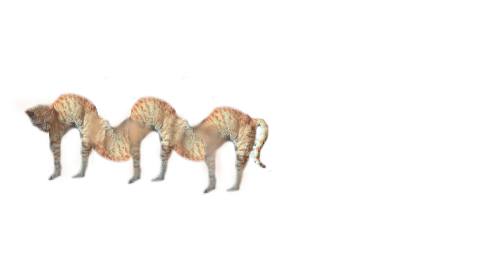

# Aero-Fighters
Our multi-month-long final project for our year two C++ programming class
and the reintroduction to our year three programming class, 
an as close replica to the original Aero Fighters arcade game as we could create.
Made using SFML.

A few useful resources for anyone that wishes to continue this:
[spritesheet info](https://docs.google.com/spreadsheets/d/1S6oiYW31RMlV090vTEgLhkFIjzwHSgbqcVWCdjcCovY/edit?gid=0#gid=0)
[archived discord server](https://discord.com/invite/gxx6pvyVTS)
google drive folder does not work as of now

